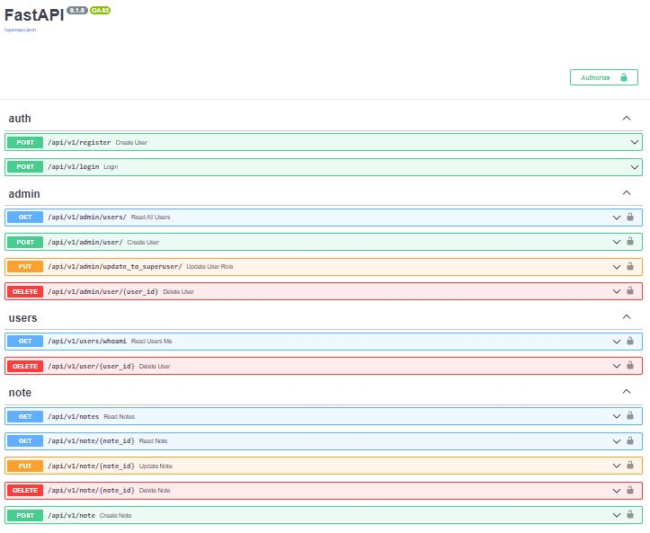

# FastAPI SQLModel Async - User Management Server

## Features

- FastAPI with JWT authentication
- PostgreSQL for database
- Async SQLModel and SQLAlchemy for ORM
- Alembic for database migrations
- Docker Compose for development

## Endpoints



### User

- Register
- Login with JWT token authentication
- CRUD operations on Note item

### Admin

- Register and login with JWT token authentication
- Create superuser
- Read all users
- Update role to superuser
- Delete users

## Usage

Spin up containers

```
docker-compose up -d --build
```

Apply database migration:

```
docker-compose exec backend alembic upgrade head
```

Add initial data:

```
docker-compose exec backend ./app/initial_data.py
```

Server is ready, go to http://localhost:8004/docs/ for Swagger docs
Login to first superuser created.
username: admin
password: admin

Bring down containers:

```
docker-compose down -v
```
